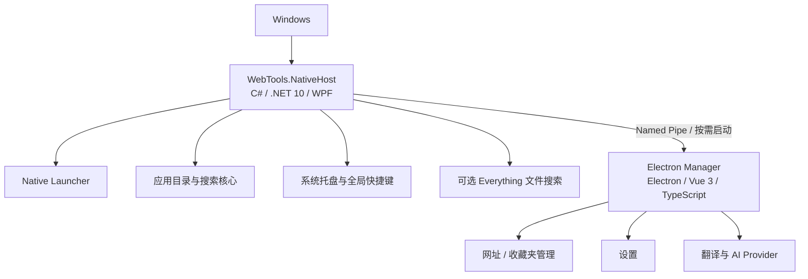

# WebTools

**一个为 Windows 打造的 Native-first 启动器与效率工具。** NativeHost 使用 C#、.NET 10 和 WPF 负责常驻搜索、系统托盘与全局快捷键；网址管理、设置和翻译等界面由 Electron Manager 按需启动。

WebTools 可以搜索并启动 Windows 应用、打开收藏网址、执行网页搜索和查找本机文件。日常唤起与搜索由 NativeHost 独立完成；只有打开管理页面或翻译时，才需要启动 Electron。

## 功能

### Native Launcher

- 搜索并启动开始菜单、桌面快捷方式、Windows 注册应用和打包应用。
- 支持中文、拼音、拼音首字母、别名及模糊匹配。
- 使用系统托盘和 Alt+Space、Ctrl+Space、双击 Ctrl/Alt、F1–F10 或高级自定义组合键快速唤起；快捷键是否可用取决于 Windows 与其他应用的占用情况。
- 搜索和打开已保存的网址；用 `/关键词` 按名称或网址筛选收藏网址。
- 用 `?关键词` 调用当前网页搜索引擎。
- 用 `file:关键词` 搜索文件和文件夹；此功能需要单独安装并运行 Everything。
- 支持浅色、深色和跟随系统主题，以及紧凑和展开布局。
- 英文搜索可显示翻译入口，并将原文交给 Manager 中的翻译页面。

### Electron Manager

- 默认打开收藏网址页面，可使用收藏夹整理网址，支持折叠文件夹、调整顺序和分类；布局会随窗口宽度自适应。
- 管理网址与应用设置。
- 提供翻译页面，支持无 API Key 的在线翻译服务和可配置的 AI 翻译 Provider。
- 在 Native-first 模式下按需启动；关闭 Manager 后 NativeHost 可继续运行。

## Windows 安装

运行 Windows 安装包后，桌面和开始菜单快捷方式会启动 `WebTools.NativeHost.exe`。Electron Manager 位于安装目录的 `Manager/` 子目录，由 NativeHost 在需要管理页面或翻译时启动；通常不需要直接运行其中的 `WebTools.exe`。更新会沿用原安装目录；如果 WebTools 正在运行，安装程序会先征求退出确认，正常关闭后在当前安装流程中继续更新。

## 架构



Launcher 与 Manager 分工运行：NativeHost 提供轻量的 Windows 常驻入口；Manager 集中承载需要完整桌面 UI 的管理和工具页面。NativeHost 通过 Named Pipe 与 Manager 通信，并在请求管理页面或翻译时启动它。

## 搜索语法

| 输入 | 用途 |
|---|---|
| `关键词` | 搜索本机应用和已保存网址 |
| `?关键词` | 使用当前搜索引擎进行网页搜索 |
| `/关键词` | 仅搜索已保存网址，可匹配名称和网址 |
| `file:关键词` | 使用 Everything 搜索文件和文件夹 |

在仓库外使用 `file:` 前，请先安装并运行 [Everything](https://www.voidtools.com/)，然后在 WebTools 设置中启用文件搜索并检测或选择 `es.exe`。WebTools 不会下载、捆绑或自动安装 Everything。

## 开发与验证

开发 Native-first 应用需要 Windows、Node.js、pnpm 9.15.9 和 .NET 10 SDK。项目通过 `packageManager` 固定 pnpm 版本。Everything 是可选组件；AI 翻译需要用户自行配置受支持 Provider 的凭据。

如果 Node.js 附带 Corepack，可先启用 pnpm 命令：

```powershell
corepack enable pnpm
```

如果没有 Corepack，可安装固定版本的 pnpm：

```powershell
npm install --global pnpm@9.15.9
```

在仓库根目录安装 JavaScript 依赖：

```powershell
pnpm install --frozen-lockfile
```

启动 Native-first 应用：

```powershell
pnpm run native:dev
```

开发时可单独启动 Electron Manager：

```powershell
pnpm run electron:dev
```

常用检查与构建命令：

```powershell
pnpm run typecheck
pnpm test
pnpm run build
dotnet build .\native\WebTools.NativeHost\WebTools.NativeHost.csproj --configuration Release
dotnet run --project .\native\WebTools.NativeHost.Checks\WebTools.NativeHost.Checks.csproj --configuration Release
```

准备版本化 Windows 构建时，先阅读 [Release Build & Version Contract](docs/release-build.md)。该流程要求干净工作区，并在 `release/` 下生成带有版本元数据和 SHA-256 清单的本地候选包：

```powershell
pnpm run release:preflight
pnpm run release:build
pnpm run release:verify -- release\<生成的产物目录>
```

`pnpm run build` 构建 Electron Manager renderer、Main 和 preload。`pnpm run native:dev` 启动 NativeHost 并按需启动 Manager；`pnpm run electron:dev` 仅用于单独调试 Manager。`pnpm run package:win` 生成 NativeHost 为入口、Electron Manager 单独安装在 `Manager/` 下的 Windows 安装包，并执行独立路径安装/卸载 smoke 验证。

## 当前状态

Native Launcher 迁移已完成。NativeHost 负责常驻搜索、系统托盘、全局快捷键和开机启动；Electron Manager 按需启动。实现与验收细节见 [Phase 4F 报告](docs/native-launcher-phase4f-removal.md)。

## 项目结构

```text
native/       WPF NativeHost、搜索核心、托盘与 Manager 通信
electron/     Electron Main、preload、IPC 与后台服务
src/          Vue 页面、共享类型和 Manager UI
resources/    应用品牌图标
scripts/      Native 开发入口及生产安装包构建脚本
docs/         架构、迁移、性能审计和实施记录
```

更多架构说明、验收记录和历史设计见[文档索引](docs/README.md)。
