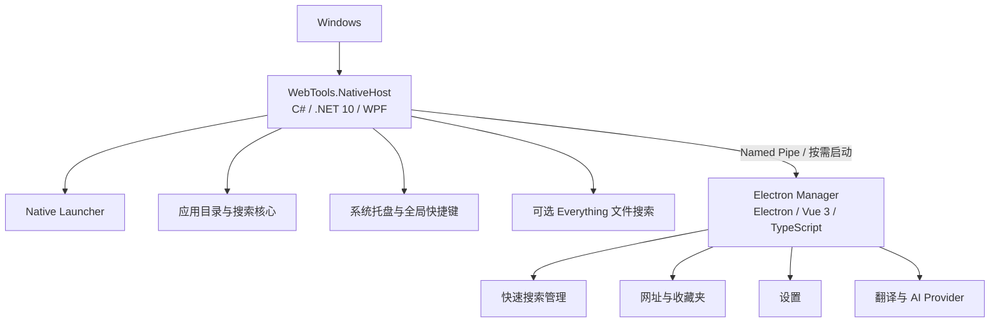

# WebTools

**一个为 Windows 打造的 Native-first 启动器与效率工具。** NativeHost 使用 C#、.NET 10 和 WPF 负责常驻搜索、系统托盘与全局快捷键；网址管理、设置和翻译等界面由 Electron Manager 按需启动。

WebTools 可以搜索并启动 Windows 应用、打开收藏网址、执行网页搜索和查找本机文件。日常唤起与搜索由 NativeHost 独立完成；只有打开管理页面或翻译时，才需要启动 Electron。

## 界面预览

当前 Native Launcher 仍处于最终验收阶段，项目截图将在迁移完成后更新。

## 功能

### Native Launcher

- 搜索并启动开始菜单、桌面快捷方式、Windows 注册应用和打包应用。
- 支持中文、拼音、拼音首字母、别名及模糊匹配。
- 使用系统托盘和可配置的全局快捷键快速唤起。
- 搜索和打开已保存的网址；用 `/关键词` 按名称或网址筛选收藏网址。
- 用 `?关键词` 调用当前网页搜索引擎。
- 用 `file:关键词` 搜索文件和文件夹；此功能需要单独安装并运行 Everything。
- 支持浅色、深色和跟随系统主题，以及紧凑和展开布局。
- 英文搜索可显示翻译入口，并将原文交给 Manager 中的翻译页面。

### Electron Manager

- 管理快速搜索、网址与收藏夹、应用设置。
- 提供翻译页面，支持无 API Key 的在线翻译服务和可配置的 AI 翻译 Provider。
- 在 Native-first 模式下按需启动；关闭 Manager 后 NativeHost 可继续运行。

## 架构



Launcher 与 Manager 分工运行：NativeHost 提供轻量的 Windows 常驻入口；Manager 集中承载需要完整桌面 UI 的管理和工具页面。NativeHost 通过 Named Pipe 与 Manager 通信，并在请求管理页面或翻译时启动它。

## 搜索语法

| 输入 | 用途 |
|---|---|
| `关键词` | 搜索本机应用和已保存网址 |
| `?关键词` | 使用当前搜索引擎进行网页搜索 |
| `/关键词` | 仅搜索已保存网址，可匹配名称和网址 |
| `file:关键词` | 使用 Everything 搜索文件和文件夹 |

在仓库外使用 `file:` 前，请先安装并运行 [Everything](https://www.voidtools.com/)，然后在 WebTools 设置中启用文件搜索并检测或选择 `es.exe`。WebTools 不会下载、捆绑或自动安装 Everything。

## 开发与验证

开发 Native-first 应用需要 Windows、Node.js/npm 和 .NET 10 SDK。Everything 是可选组件；AI 翻译需要用户自行配置受支持 Provider 的凭据。

在仓库根目录安装 JavaScript 依赖：

```powershell
npm install
```

启动 Native-first 应用：

```powershell
npm run native:dev
```

旧 Electron Launcher/reference 入口仍保留：

```powershell
npm run electron:dev
```

常用检查与构建命令：

```powershell
npm run typecheck
npm test
npm run build
dotnet build .\native\WebTools.NativeHost\WebTools.NativeHost.csproj --configuration Release
dotnet run --project .\native\WebTools.NativeHost.Checks\WebTools.NativeHost.Checks.csproj --configuration Release
```

`npm run build` 构建 Electron Manager。仓库中的 `npm run package:win` 仍使用现有 Electron Builder 配置生成旧 Electron 应用安装包；Native Launcher 的 Phase 4E 验收包由 `scripts/build-native-phase4e-acceptance.ps1` 单独生成。Phase 4E 安装包用于测试，不代表 production installer migration 已完成。

## 当前状态

Native Launcher 正处于 Phase 4E 最终用户验收阶段，部分 Windows GUI 和生命周期检查仍待人工完成。生产安装器迁移尚未完成，旧 Electron Launcher 与现有 Electron 打包配置仍保留。

## 项目结构

```text
native/       WPF NativeHost、搜索核心、托盘与 Manager 通信
electron/     Electron Main、preload、IPC 与后台服务
src/          Vue 页面、共享类型和前端搜索/翻译逻辑
resources/    Electron 应用与托盘图标
scripts/      Native 开发入口及验收包构建脚本
docs/         架构、迁移、性能审计和实施记录
```

更多架构说明、验收记录和历史设计见[文档索引](docs/README.md)。
