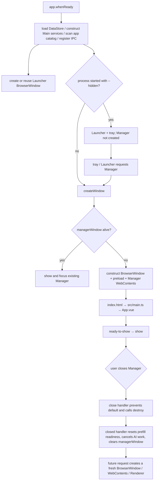
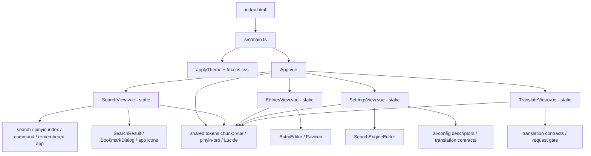
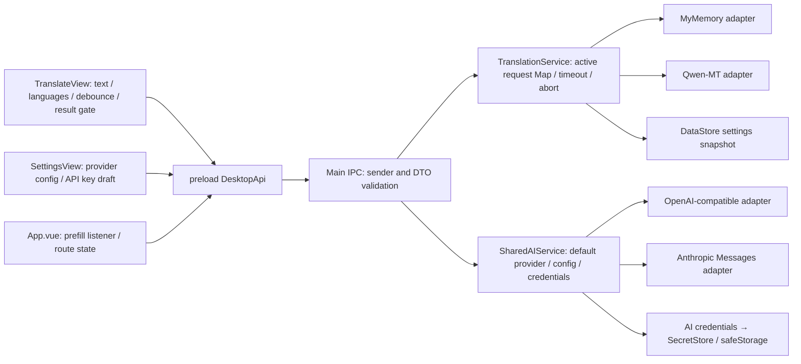

# WebTools Performance Optimization — Phase 3A：Manager Audit

审计日期：2026-09-28。范围是当前工作区的 Manager 窗口、Renderer 页面、Translation handoff、主进程 Provider 生命周期与当前 Windows production build。Phase 3A 仅审计和测量，没有实施 Manager 优化、没有新增依赖，也没有更改数据结构。

当前工作区在本审计开始前已有 Phase 1 / Phase 2B 未提交修改。为测量曾短暂添加一个环境变量形式的临时 userData 路径钩子，之后已还原；最终 Main build 使用原有路径逻辑。源码、依赖和产品行为没有保留任何审计专用修改。

## 1. Executive Summary

- Manager 是一个按需创建、关闭时调用 `BrowserWindow.destroy()` 的独立 BrowserWindow / WebContents / Vue Renderer。普通手动启动会创建 Manager；`--hidden` 登录启动只创建 Launcher。应用中最多各有一个 Launcher 和 Manager BrowserWindow。
- `index.html → src/main.ts → App.vue` 静态导入 Search、Entries、Settings、Translate。当前构建没有页面级 dynamic import；打开 Manager 时四个页面模块都会进入 Manager Renderer 的初始 JS 加载、解析和模块求值路径。不过各 SFC 的 setup、响应式状态、IPC 和 DOM 只在相应页面 mount 时创建。
- 当前 Manager Renderer 首载核心是共享 `tokens` chunk（Vue、pinyin-pro 字典与 Lucide）加 Manager entry chunk。Manager 默认 Search mount 后建立自己的搜索索引。Renderer 不包含 Main 的翻译 Provider adapters 或 HTTP SDK。
- TranslationService、SharedAIService 和 adapter 对象在 Main 启动阶段创建，不随 Manager 页面开关。它们不持有页面 DOM；翻译请求和 AI 连接测试都用 AbortController，并在结束时清理。Manager destroy 会触发 Main 取消活动请求。
- 静态审查确认一个 Translation 生命周期竞态：TranslateView 的异步 `onMounted` 初始化即使在组件 unmount 后完成，仍会把 `settingsReady` 设为 true 并安排自动翻译。这可能导致离开页面后才发起一次请求；它是有界的异步生命周期问题，不是持续增长证据，应列入 Phase 3B。
- 页面级拆分最值得做一次实验的是 Settings；它在当前 Manager entry 的 sourcemap 模块内容中最大。它能推迟未访问页面的代码解析/求值，不应承诺降低已访问后的长期内存。Search 是默认页，不建议 lazy load。Translate 源码体量较小且 handoff 需要改为组件确认后才 ack，暂不优先。
- 运行时 A–I 分页面采样和 20 次 Manager close/reopen 压测没有取得数据：当前执行环境的 Electron GPU 子进程以 `0xC0000135`（DLL 不可用）退出，无法保持 GUI/CDP 会话。历史安装版读数仅作为背景，不能冒充本轮受控采样，也不能据此宣布无泄漏。

## 2. Manager Lifecycle

| Question | Code-confirmed behavior | Runtime confidence |
| --- | --- | --- |
| When is Manager created? | `app.whenReady()` creates Launcher, then calls `createWindow()` unless `--hidden` is present. Tray and Launcher actions also call `showManager()`. | Static path confirmed. |
| Does `--hidden` create Manager? | No. It skips `createWindow()` but still initializes Main services, Launcher, tray and IPC. | Static path confirmed. |
| Can Manager be duplicated? | `createWindow()` reuses a live `managerWindow`; otherwise creates one and assigns the reference before loading. | Normal app path guarded; not OS-stress-tested. |
| What does close do? | `close` is prevented when not quitting, then `window.destroy()` is called. `closed` resets translation queue readiness, cancels translation and AI connection tests, and sets `managerWindow = null`. | Native destroy behavior is code-confirmed; OS process reclamation not measured here. |
| Is the Renderer released? | Destroying the owning BrowserWindow tears down its WebContents; no Manager reference is retained in a Main cache after `closed`. | Expected from Electron lifecycle; actual renderer PID exit and private-memory return require Windows runtime sampling. |
| What happens on reload? | A main-frame navigation resets prefill readiness and cancels active AI work. The root App mounts, subscribes to prefill, then calls `managerReady`; an unacknowledged request can be delivered again. | Static path confirmed. |

`electron/main.ts` has exactly two `new BrowserWindow(...)` sites: Launcher and Manager. No `BrowserView` or `WebContentsView` creation exists. Each window owns its own WebContents and Renderer JS realm. The number of Chromium OS Renderer, GPU and Utility processes is not inferred from the number of windows; this audit could not capture the process tree.

## 3. Manager Dependency Graph

以当前 `electron.vite.config.ts`、`index.html`、`src/main.ts`、`src/App.vue` 和 production sourcemap 为准：项目无 `defineAsyncComponent` 或产品运行时 `import()`。`import type` 被 TypeScript 擦除，不代表其目标进入 Renderer；以下结论按最终 source map 中实际模块确认。

Manager 的 HTML 初始加载 Manager entry 并 `modulepreload` 共享 tokens chunk。App 在模块顶层静态导入四个页面组件，所以四页模块均随 Manager 首次 Renderer 加载、解析及求值；它们不是各自独立的 Manager-only chunk。Vue SFC 的组件 `setup()`、页面 watchers、请求和 DOM 仍然只在 `v-if` 对应分支挂载时执行。

Manager / Launcher 都使用 Vue、Lucide 和拼音搜索，因此 Vite 生成共享 tokens chunk。`pinyin-pro` 随此 chunk 提供给两入口；这属于当前双入口的共享构建组织，并不意味着 Main process 加载拼音库。Chromium/V8 在不同 Renderer 之间是否共享已编译代码或底层只读页，需运行时工具测量，不能仅依据构建文件判断。

## 4. Bundle Composition

通过 `npm run build -- --sourcemap` 检查实际 production 产物与 source map 模块列表，再执行普通 `npm run build` 恢复无 sourcemap 的正式输出。普通 build 后产物如下；字节是磁盘上的未 gzip 资源大小，不是 RAM：

| 资源 | 当前大小 | 说明 |
| --- | ---: | --- |
| `out/renderer/assets/index-B_hyDdD2.js` | 135,737 B | Manager entry；静态含 Search、Entries、Settings、Translate。 |
| `out/renderer/assets/tokens--rXsKpsl.js` | 655,063 B | Manager 和 Launcher 共用，含 Vue、pinyin-pro 及共用代码；两个 HTML 都 preload。 |
| `out/renderer/assets/index-S1CnedOF.css` | 3,539 B | Manager entry 样式。 |
| `out/renderer/assets/tokens-CTe298EE.css` | 49,941 B | Manager 与 Launcher 共用样式。 |
| `out/preload/index.js` | 8,200 B | 两窗口共用的 contextBridge IPC 封装。 |
| `out/main/index.js` | 133,000 B | Main 服务与 IPC；不属于 Renderer chunk。 |

source map 对 Manager entry 记录 36 个模块。按 source map 中模块内容原始字节归类（这是模块内容量，不是 minified chunk 精确分摊）：

| 页面/来源 | Source map 模块内容 |
| --- | ---: |
| Settings（含 SearchEngineEditor） | 31,460 B |
| Search | 22,081 B |
| Entries | 10,889 B |
| Translate | 9,672 B |
| Shared utilities | 14,130 B |
| Lucide Vue wrapper | 15,949 B |
| 其他应用入口代码 | 6,118 B |

共享 tokens chunk 的 source map 模块内容约为：pinyin-pro 540,012 B，Vue 422,696 B，Lucide 13,673 B，shared app code 10,609 B，其他应用代码 4,392 B。以上数值只能说明哪些源码模块进入了哪个 chunk，**不得换算成运行内存**。当前没有 Markdown renderer、syntax highlighter、第三方 HTTP client 或 Provider SDK 依赖；依赖清单只有 Vue、`@lucide/vue`、`pinyin-pro`（另有构建工具）。

如果用户打开 Manager 后始终停留在默认 Search：四个页面的 JS 模块已经加载、解析、求值，并由模块系统保持引用；Settings、Entries、Translate 的组件实例、setup refs、DOM、页面 IPC 则尚未创建。进入页面后，SFC setup 才运行。使用当前 `v-if` 离开页面会销毁实例与 DOM，但不会从 Renderer 的 ESM 模块缓存卸载已经导入的页面代码。

## 5. Page-by-page Runtime Profile

本轮尝试运行 `npm run electron:dev` 并用 `--remote-debugging-port` 采样。默认 `%APPDATA%` 在执行沙箱内不可写；临时把 userData 指向有权限的隔离目录后，Electron 仍在创建 GPU process 时以 `-1073741515`（`0xC0000135`，所需运行 DLL 不可用）退出，未能保持 Manager GUI/CDP 会话。`--disable-gpu` 也未能绕过该 GPU 子进程启动失败。审计钩子已还原，隔离 profile 和本轮测量缓存已清理。

因此 A–I 无本轮数值；没有采集 heap、DOM、CPU、进程私有内存或 listener 数。下表保留请求中的状态顺序，并将用户历史读数单列为背景，不把不同时间/配置的值当作差分：

| 状态 | 计划状态 | 本轮实测 | 用户历史背景（非受控、不可横向推断） |
| --- | --- | --- | --- |
| A | Launcher only / Manager closed | 未测：Electron 未能持续启动 | 约 111 MB idle；其他时段约 125 MB。 |
| B | 新开 Manager，Search 默认页 | 未测 | Manager open 总量约 152 MB。 |
| C | Search 页面 | 未测；它就是默认页，但无法把 Manager 与 Launcher 分开测 | 无单独值。 |
| D | Entries 页面 | 未测 | 无单独值。 |
| E | Settings 页面 | 未测 | 无单独值。 |
| F | Translate 页面、未翻译 | 未测 | 无单独值。 |
| G | 完成一次普通翻译 / AI 翻译 | 未测 | Translation 使用后约 175 MB，未区分普通与 AI。 |
| H | 切回默认 Search | 未测 | 无单独值。 |
| I | 关闭 Manager | 未测 | Translation 后关闭 Manager 约 125 MB。 |

本轮没有对历史读数做“173→152”式估算；任务管理器工作集、Private Bytes、JS heap 和 Native/GPU 缓存不是同一指标。Phase 2B 的开发版 A/B 测量也不属于 Manager 页面剖面，不在本表复用。

## 6. Mount / Unmount Lifecycle

`App.vue` 使用 `v-if / v-else-if` 独占渲染四个页面；没有 `KeepAlive`、Router 或页面 Store。切换页面时上一组件实例及 DOM 卸载，新页面重新执行 setup / `onMounted`。页面局部状态不会跨切页保存；Manager 关闭销毁 Renderer 后也不会保存页面状态。

| Page | Mounted resources / work | Unmount cleanup | Unmount 后仍可能完成的工作 | 风险判断 |
| --- | --- | --- | --- | --- |
| Search | 加载设置、应用、网址；建立本页 Search index；对可见结果请求应用图标；Document `pointerdown` 监听；`file:` 输入有 160 ms timeout 后调用 Everything IPC。 | `onUnmounted` 移除 Document 监听；Vue 自动停止组件作用域 watchers。 | 文件搜索 timeout 未保存/清除；只要当前 search sequence 未变化，页面离开后仍可能发出 Everything IPC 并更新已卸载组件 ref。初始列表与图标 IPC Promise 也不能由页面取消。 | 有界、短期工作；没有证据形成长期保留。作为小型 cleanup candidate。 |
| Entries | mount 时并行读取 websites、bookmark folders、settings；本页保留完整网站/文件夹 refs。 | 无自定义 observer/listener/timer。 | 刷新 Promise 无取消；完成后只写入即将被 GC 的组件 refs。 | 未发现持续生命周期问题；未测数据量/图标对 heap 的影响。 |
| Settings | mount 时读取设置、AI provider descriptors、translation provider info；随后并发读取各 provider status，再 detect Everything。表单状态、草稿、错误和 API Key 输入暂存于本页 refs。 | 无自定义 IPC/DOM listener；Vue 自动停 watch。 | mount 初始化的多步 Promise 可在卸载后继续并写 refs。`markSaved` 的 1.8 秒 timeout 不清理。AI connection test 由 Main 持有 AbortController，页面卸载时没有 cancel IPC；它会运行到结束/30 秒 timeout，或 Manager 关闭时由 Main abort。 | 请求数量有界；异步更新已卸载 refs 不等同于持续泄漏。离开页面后连接测试继续是明确的有界后台工作。 |
| Translate | mount 时读取翻译语言设置和 Provider info；维护 source/result/loading/error/copied refs；输入变化自动翻译 debounce 450 ms；语言偏好保存 debounce 180 ms；活动翻译 request。 | `onBeforeUnmount` 清除两个 debounce timer 并通过 request gate 取消活动翻译；watch 在 Vue scope 停止。复制反馈 timeout 无清除，但 generation 变化后不会更新状态，最多短暂持有闭包。 | mount 初始化 Promise 不取消；详见第 7 节竞态。未完成的语言设置保存请求可能自然完成。 | 确认有初始化竞态可能在 unmount 后安排翻译；不是长期 cache 增长。 |
| App root | Manager 全生命周期持有 `translationPrefill` 与一条 Main→Renderer prefill listener。 | root `onBeforeUnmount` 调 preload 返回的 unsubscribe；Renderer 销毁也会清理其上下文。 | Manager window 被 native destroy 时，Vue unload hook 是否一定执行没有在此环境运行确认；但 IPC listener 随对应 Renderer context 销毁，不是 Main 全局监听器。 | 无重复注册路径；每个 Manager Renderer root 只注册一次。 |

Vue 的 `computed`、`watch` 和 `watchEffect`（当前页面）归属于组件 effect scope，组件卸载时停止；未使用 MutationObserver。ResizeObserver / IntersectionObserver 在 Launcher，不属于 Manager 本次重构范围。源码中没有产品 `setInterval`。主进程 IPC handler 在 `app.whenReady` 一次性注册，不随页面切换重复添加。

**页面状态现状：** Search query/选择结果切页丢失；Entries folder filter 与编辑 UI 切页丢失（网站数据从 Store 重读）；Settings 未提交的 API key / AI draft 切页丢失，已提交设置由 DataStore 保持；Translate source/result 是 TranslateView 本地 state，离开翻译页或关闭 Manager 会丢失。`App.vue` 的 translation prefill 是临时共享状态，直到消费确认或被新请求替代。Phase 3B 不应意外改变这些行为。

## 7. Translation Renderer Audit

Renderer UI 不直接使用 fetch、Provider adapter、SecretStore、safeStorage 或 Node API。`SettingsView` 导入的 `ai-config` 是 renderer 可用的 provider 设置/描述与校验模型，不是 AI 网络客户端；`TranslationProviderInfo` 等 IPC 类型使用 `import type`，运行时擦除。Manager sourcemap 没有任何 Main adapter 或 Provider SDK 模块。

Main 在 app startup 创建一个 `AIProviderCredentialStore`、`SharedAIService`、`TranslationService`，并实例化 OpenAI-compatible、Anthropic、MyMemory、Qwen-MT adapters。构造发生在 `createWindow()` 前，与 Manager 是否打开无关。Adapter 包装 `fetch`、无大对象缓存、没有自身 timer/listener；网络请求时才读取 key 并创建请求 body。`SecretStore` 保存加密数据，credential `get()` 才解密读取；未发现长驻明文 token cache。

`TranslationService.translate()` 创建 request AbortController + 45 秒 timeout，`finally` 删除 active Map 条目并清 timer；Renderer `onBeforeUnmount` 通过 request ID 请求 cancel，数据/翻译配置更新及 Manager close 也会 cancel。AI connection test 在 Main Set 中跟踪，30 秒超时，finally 清除；Manager `closed` 时 cancel all。没有页面实例被 Main Provider 持有。

**确认的初始化竞态（Phase 3B candidate）：** `TranslateView.vue` 的 `onMounted(async () => ...)` 等待 `getSettings()` 和 `getTranslationProviderInfo()`。`onBeforeUnmount` 会置 `settingsReady=false` 并清 timers/request；但 Promise 返回后 `finally` 无 mounted/generation 检查，重新置 `settingsReady=true` 并调用 `scheduleAutoTranslate()`。若 prefill/输入仍非空且 Provider configured，组件已卸载后仍可安排 450 ms 自动翻译。这不是常驻泄漏，但属于应修复的生命周期副作用。本阶段未修改。

`SettingsView` 的 async mount load 也没有 disposed/generation guard，页面快速切换时会继续执行只读 IPC 并设置卸载 refs。AI connection test 在 Settings 被切走后不会取消，但 Main close/30 秒 timeout 有边界。它们都没有持有窗口外的页面引用；建议 Phase 3B 评估统一的 mounted/request-generation guard，并在需要时给连接测试补有界取消契约。

## 8. Settings / AI Boundary Audit

- 设置 UI 将普通设置、AI 配置、API key 保存/删除、Provider status、连接测试通过 `window.desktop` 交给 preload/Main。
- Renderer 只保存用户正在输入的 API Key draft；真正凭据存储与解密在 Main 的 SecretStore/safeStorage 路径。
- Provider endpoints、请求鉴权头、网络 JSON 解析、redirect/error 策略都在 Main adapters。
- 没有 AI SDK / Provider HTTP client / crypto implementation 被打入 Manager Renderer。Manager 搜索不存在 Renderer Node/fs 能力；BrowserWindow 为 `contextIsolation:true`、`nodeIntegration:false`、`sandbox:true`。
- `preload.ts` 为 IPC invoke/send 薄层，返回 listener unsubscribe，没有设置业务缓存、Provider 初始化、网络请求或 timer。
- IPC handlers 在 Main `whenReady` 单次注册。针对 Manager 的 Settings / AI / Translation handler 做 Manager 主 frame sender 校验。多个独立 method 是接口粒度，不构成重复注册或轮询证据。

## 9. Main Provider Observations

| Resource | Creation / retention | On demand / cleanup | Audit result |
| --- | --- | --- | --- |
| `SharedAIService` | Main startup 构造一次，持有 DataStore、credential facade、两个无状态 completion adapter。 | 只有 Provider info、connection test 或 translation IPC 时才读设置/请求。 | 不依赖 Renderer/Manager 生命周期；无发现的大型 cache/timer。 |
| `TranslationService` | Main startup 构造一次，持有配置/adapter ports 和一个活动请求 Map。 | 翻译请求创建 AbortController、timeout；finally 清理；Manager close/settings change 可批量 cancel。 | Map 内容按请求结束移除；没有 confirmed retention。 |
| Provider adapters | Main startup 创建轻量实例。 | 调用时走原生 fetch、共享 AbortSignal；完成后响应/body 局部变量离开作用域。 | 没有第三方 SDK 或连接池常驻证据。 |
| `AIProviderCredentialStore` / `SecretStore` | startup 构造；加密文件由 Main 管理。 | 单次读凭据按需解密；未缓存明文 key。 | Manager 每次打开不新建它们。 |
| AI connection test | Main IPC 每次创建 AbortController，放入 active Set；30 秒 timeout。 | finally 清 timeout/Set；Manager close 调用返回的 cancel handler。 | 从 Settings 页面离开不会 cancel；有时限但可能继续做网络请求。 |

这些 Main 对象已包含在 Launcher-only 进程状态，不是打开 Manager 才新增的成本。若后续测量显示 Main startup 成本需要优化，应归 Phase 4；Phase 3B 不应为减少 Manager 页面载荷迁移 Provider。

## 10. Lazy Loading Feasibility

| Page | Current state | Lazy loading feasibility | Expected effect / decision |
| --- | --- | --- | --- |
| Search | 默认页面；entry 源码/模块内容约 22 KB；mount 时初始化搜索数据和索引。 | 技术上可拆，但首进 Manager 必须马上显示它；异步切片可能把等待放在默认体验上。 | 不建议 lazy load。共享 Vue/pinyin chunk仍必须在首屏加载。 |
| Entries | page + EntryEditor/Favicon，source map 模块内容约 10.9 KB；数据只在 mount 时读取。 | `App.vue` 对该 page 换成异步导入后可产生独立 chunk；需要确认最终 `assets` 实际有 chunk。 | 代码体量较小，收益预期低；除非真实 startup profile 显示解析压力，不优先。 |
| Settings | 四页中最大，约 31.5 KB module source content，另有 SearchEngineEditor；只在 mount 才触发 provider status/Everything 初始化。 | 可通过异步导入获得独立 Settings chunk，并把读取/解析/求值推迟到用户进入设置时。 | **最值得做一次受控 Phase 3B 实验。** 只改善未访问时的 Manager initial parse/evaluate/retained module code；打开 Settings 后代码仍在 Renderer module cache，不能承诺长期 RSS 下降。 |
| Translate | 约 9.7 KB module source content；本地 refs 较多但无大列表/大型 SDK。 | 可拆 chunk；必须同步 redesign prefill ack，避免 chunk 尚未 resolve 就清空 prefill。 | 直接内存收益证据不足，先修生命周期竞态并保障 handoff；之后再测首次进入延迟与实际 heap，暂不排优先。 |

**Bundle 与 runtime 的边界：** 页面 dynamic import 预计能把未访问页面的 JS 移出 Manager 初始 entry 并延后 parse/evaluate；Vue、pinyin-pro、图标仍是初始 Search 需要的 shared chunk。`v-if` 已经让未访问页面的 setup state/DOM 不存在，因此 lazy load 不会省掉这些不存在的实例。访问页面后 Vite/ESM module cache 会留住 chunk 模块，直到 Manager Renderer 销毁；它主要改变首次加载路径和未访问页面代码保留量，不一定明显降低 visited 状态或 BrowserWindow process memory。

如果进入 Phase 3B，必须在产物中看到新增页面 chunk，而不是只凭源码改动推断拆分成功；同时记录 cold Manager 首开、首次点击 Settings/Translate 的可交互延迟，空白占位和错误处理需由真实完成事件驱动，不用固定 timeout。

## 11. Navigation / Prefill Race Analysis

**当前 handoff 路径：** Launcher `openTranslation(text)` 校验当前 Launcher sender 和 1–20,000 字符长度，生成 request ID 并放入 Main 的单项 latest-wins `TranslationPrefillQueue`；`showManager()` 创建/显示 Manager；Manager 尚未 ready 时队列保留请求。`App.vue` mounted 后先订阅 prefill，再发 `managerReady`。Main 确认当前 manager WebContents sender 后将 plain `{ id, text }` 发给 Renderer；App 更新自己的 `translationPrefill` 和 `activeSection='translate'`，等 `nextTick` 后 ack Main 并清空该 prefill。当前 Translate 是同步静态导入，Vue 本轮 flush 会 mount TranslateView 并把精确原文通过 prop 交给其 immediate watcher。Renderer 间的数据是窄 plain DTO，不传 Vue Proxy/ref、Node API 或 filesystem path。

该路径涵盖 Manager 尚未创建、renderer 加载、已经打开和已隐藏后被 show 的正常创建/ready 状态。主 frame sender/当前 manager window 校验存在；Manager reload 会 reset readiness，仍 pending 的请求在新 root `managerReady` 后重送。已 ack 的请求从 Main 队列消费；Manager 后续 reload 不承诺恢复已消费的瞬时翻译输入，这与本应用其他页面 state 在关闭/重建后不保留的现状一致。

**若 Translate 改成 async component，当前 ack 时点会过早。** Vue `nextTick` 只保证同步渲染 flush；它不等待 `defineAsyncComponent` 的模块下载/求值。App 可能先 ack 并把 `translationPrefill` 清空，随后 Translate chunk 才 mount，拿到的是 null，从而丢失 Launcher 原文。Phase 3B 必须先改成组件消费/ready ack（带 request ID），或由 App 保留最新 prefill 直到 Translate 明确确认接收；仅等待 `nextTick` 不足以保护异步 chunk。再覆盖 Manager 创建/已存在隐藏、request 替换、reload 的集成测试，确认最新文本只预填一次且不产生 structured-clone 问题。

目前 TranslateView 收到 prefill 会调用既有 `scheduleAutoTranslate()`；当 Provider 已配置且初始化完成后会按当前 450 ms 自动翻译交互发出请求。这个行为属于现有翻译交互，不在 Phase 3A 改动；Phase 3B 的 handoff 验证应检查页面输入原文和实际既有自动翻译行为。

## 12. Manager Close / Reopen Stability

请求中的 `Manager open → close` 20 次和 `Manager → Translate → translation → close` 10 次，本轮未能在 Codex 环境执行，因为 Electron GPU process 不能启动。本轮没有采集 close 后 Main、Launcher Renderer、GPU、Utility 的 memory，也未做强制 GC 前后对比；不能据此给出实际泄漏结论。

静态代码没有发现 Manager BrowserWindow 被 Main 全局集合缓存：`closed` 后 manager ref 清空；旧 WebContents 的导航 listener 绑定在旧 WebContents 自身。翻译活动请求和 AI connection tests 会由 Main 取消。Launcher 与 Main 服务按设计继续常驻。浏览器/GPU/Utility 进程是否复用以及私有内存是否回落仍需实机观察。

用户历史观察为 Launcher/Manager closed 约 111 MB、Manager open 约 152 MB、翻译使用后约 175 MB、关闭 Manager 后约 125 MB；此前多轮没有持续单调增长。由于不是固定版本/固定操作顺序/强制 GC 的连续采样，它只能说明尚未观察到明显单调趋势，不能证明 close 后零残留，也不能定量归因到 Manager。

### 可重复的用户 Windows 基线步骤

1. 退出 WebTools 后启动安装版；在相同电源、显示器、网络和桌面条件下记录各 WebTools PID 的 Working Set 与 Private Bytes。单独标记 Main、Renderer、GPU、Utility；任务管理器“内存”列可能是工作集，不与 Private Bytes 混用。
2. 固定顺序采样 A–I：启动 idle 30 秒、Manager 首开后 Search、逐页打开 Entries/Settings/Translate、普通翻译、AI 翻译、切回 Search、关闭 Manager。每状态等 30 秒采样 3 次，记录时间与操作顺序。
3. 对 Renderer JS Heap / DOM / CPU 用 audit-only CDP 或 DevTools：`Runtime.getHeapUsage` 取 heap used/total；`Performance.getMetrics` 取 JS heap、Nodes、JSEventListeners、TaskDuration。采样是否调用 `HeapProfiler.collectGarbage` 必须单独标注；默认先记录未强制 GC，然后在可比轮次强制后取样。
4. 用 PerfMon/任务管理器进程树每秒或每 5 秒采样 PID 私有字节/工作集；由 PID 与 process type 区分 Main/Renderer/GPU/Utility。不要把 `SystemInfo.getProcessInfo` 当作私有内存接口，它主要给出 PID、类型和 CPU 时间。
5. 先 idle 10 分钟；再执行 20 次 Manager open/close；再以低次数执行 Translate 与翻译后 close 循环。每轮之间等待相同时间，并比较 GC 后基线及后续 5/10 分钟斜率。单次峰值或 V8 尚未 GC 的 heap 增加不算 leak；持续多轮不能回落的 Private Bytes/heap/DOM/listener 趋势才值得进一步 heap snapshot。
6. Event Listener 数只有在 CDP/DevTools 能可靠读取时才记录；不通过页面代码注入生产调试计数器。Vue component count 当前无低成本可靠测量方式，记录 Unknown。

## 13. Optimization Candidates

| Candidate | Evidence | Expected Benefit | Risk | Complexity | Phase |
| --- | --- | --- | --- | --- | --- |
| Translate async init teardown guard | `TranslateView.vue` 初始化 finally 无 mounted/generation 检查，能在 unmount 后 schedule 自动翻译。 | 内存收益低；防止无页面时发起网络请求和状态写入。 | Low | Low | 3B，优先修复 |
| Settings page dynamic import experiment | Settings 是 Manager entry 最大 page module source group（约 31.5 KB）；未访问时 setup 尚未执行，但模块仍被初始加载/求值。 | 对 Manager initial parse/evaluate 和未访问页模块保留量预计 Medium；实际 heap / RSS Unknown。 | Medium；首进 Settings 可能等待，行为回归风险可测试。 | Low–Medium | 3B，首选性能实验 |
| Entries dynamic import | 约 10.9 KB module source group；setup 本来就在首次访问才创建。 | Low；只省未访问页面代码的 initial load。 | Medium（首进延迟）。 | Low | 3B，依 runtime 证据 |
| Translate dynamic import | 约 9.7 KB source group，较小；init guard 确认有风险。 | Low / Unknown；不应按 bundle bytes 宣称 RAM 节省。 | High if prefill ack timing unchanged；有首进翻译空白风险。 | Medium | 3B 后续，仅在握手稳妥后 |
| Search dynamic import | Search 是 Manager 默认页且需要 pinyin shared chunk。 | Low；可能增加默认首次交互延迟。 | High for perceived first-open response. | Low | Not recommended |
| Cancel Search `file:` timeout on unmount | 160 ms debounce 与 IPC 不以页面卸载为取消条件。 | Low；避免过期的一次 IPC。 | Low | Low | 3B cleanup if touched |
| Cancel Settings AI test on page switch | Main tracks request and cancels on Manager close, not when Settings page unmounts. | Low/Unknown；更早结束无界面下的网络活动，但请求最大 30 秒。 | Medium (need a bounded request-ID cancel contract). | Medium | 3B only if page switching causes real cost |
| Eager Main Provider object construction | Adapter/services created at app startup even when Manager is closed; they contain no SDK cache or timers. | Low / unmeasured, affects Launcher baseline more than Manager open delta. | Medium (affects translation wiring). | Medium | Phase 4; do not fold into 3B |
| Manager BrowserWindow lifecycle redesign | Window is destroyed and reference cleared on close; no static evidence of retained Manager window. | Unknown without process evidence. | High; could regress reopen/prefill behavior. | High | Not recommended from current evidence |

## 14. Phase 3B Recommended Order

1. **先取得真实安装版 baseline。** 在用户 Windows 机器按第 12 节测量 A–I 和 20 次 close/reopen；本审计环境没有可靠 Runtime Heap/Private Bytes 结果，先避免盲目做 RAM 优化。
2. **修复已确认的 TranslateView unmount/init 竞态。** 用测试覆盖初始化 Promise 在 unmount 后完成时不设置 ready、不安排翻译；验证普通请求取消路径不变。
3. **仅实验 Settings async chunk。** 修改后确认 Vite 真正生成 Settings-only chunk；核对 Manager 初始 entry 缩小、四页功能/数据不变、首次进入 Settings 有正常 loading/错误反馈，并按同一基线测 first-open JS parse/heap 与用户等待。若实测无变化或等待明显，撤回。
4. Entries 与 Translate 是否拆分由新的页面级数据决定。对 Translate，必须先把 prefill acknowledgement 移到实际组件消费/ready 后，并测试 Manager 创建、已开/隐藏、请求替换与 renderer reload；否则不要异步化。

本顺序把一次有证据的生命周期修复与性能假设分开测量，避免把多个因素合在一起比较。Search 不纳入当前推荐拆分。

## 15. Risks / Do-Not-Optimize List

- 不要把静态 bundle bytes 直接换算为 RAM；不声称 page chunk 一定降低整个 Electron task group 的 MB。
- 不要把 `v-if` unmount 等同于模块代码卸载；它释放页面实例和 DOM，静态 import module 仍在 Renderer module cache 中。
- 不要为了 Manager 每次开关去重建 Main services；它们本来是应用级服务，且构造成本未实测。
- 不要改 Manager `destroy()` / Launcher 常驻 BrowserWindow / Main window 架构；没有确认的生命周期泄漏证据，且现有关闭与快捷启动是产品行为。
- 不要用 `KeepAlive` 保存大页面或静态页面状态，除非先获得明确 UX 要求。
- 不要引入 Vue Router、Provider SDK、依赖或 Main/Renderer 迁移来完成 Phase 3B 的局部实验。
- 不要改变 Search、Entries、Settings、Translate 当前切页丢状态行为。
- 未来异步页面不得直接把 Vue Proxy/ref 作为 IPC payload；只通过结构化可克隆 plain DTO。
- 不要仅以 forced-GC 前的单点 heap 或 Task Manager Working Set 宣告泄漏。

## 16. User Manual Tests Required

由于当前 Codex 环境无法让 Electron GPU process 稳定启动，以下需要在用户 Windows 安装版验证：

- Manager 手动启动与 `--hidden` 启动时的窗口数、Renderer/WebContents 数；Manager close 后 PID/WebContents 是否结束或复用。
- A–I 页面顺序的进程组、Main、Renderer、GPU、Utility、JS Heap、DOM Nodes、TaskDuration 采样。
- Search / Entries / Settings / Translate 切页 20 次，DOM 与 JS heap 在 GC 后是否回落；逐页检查 query/filter/未保存设置/译文仍按当前行为销毁。
- Translate 快速离开页面时，异步初始化完成后是否出现未预期翻译网络请求（静态代码显示存在可能）。
- Settings 开始 AI connection test 后立即切换页面，确认其请求可能继续；再关闭 Manager，确认 Main AbortController 能取消。
- Manager open/close 20 次以及 Translation 后 close 的 Private Bytes、Renderer PID、GPU/Utility 变化趋势。
- 若 Phase 3B 实施 lazy loading，确认 Manager 默认页不变慢、首次 Settings 页面没有空白/点击无响应、Translate prefill 在 async chunk ready 前后不丢。

可在真实安装版重复捕获的具体指标和步骤见第 12 节。当前没有通过 GUI 实际执行上述人工项目。

## 最终问题

### Q1：Manager 当前增加的资源主要来自什么？

用户历史测量显示 Manager 打开伴随约 41 MB 的总进程组差值（111→152 MB），但不是本轮受控采样，不能归因。代码和构建显示最主要的确定性增量是**独立 Manager Renderer / WebContents 与 Vue Runtime**，加上 Manager 默认 Search 所需的 `pinyin-pro` 字典/索引与 Manager 页面代码；四页静态模块都初始加载。Main 的 Translation/AI services 已在 Launcher-only 时创建，不是 Manager 窗口的新增资源。各组成的实际 Private Bytes/JS heap 份额当前 Unknown。

### Q2：Search / Entries / Settings / Translate 中哪些页面值得 lazy loading？

Search 是默认页且依赖 shared pinyin chunk，不推荐。Settings 是最大的未默认展示页面，值得作为 Phase 3B 的第一项受控 dynamic import 实验。Entries 的模块较小，证据不足，暂缓。Translate 模块较小，先修复 async init 生命周期问题；若之后拆分，必须先解决第 11 节 prefill ack race。页面拆分主要减少未访问时的加载/解析/模块保留量，不保证降低访问页面后的长期内存。

### Q3：Manager close 后是否存在已确认的资源未释放或持续增长？

未发现静态代码可确认的 Manager window/ref 永久保留或 Main 请求 cache 持续增长：close 会 `destroy()`，`closed` 清引用并取消活动 AI 工作。但本轮无法运行 20 次 reopen，所以 Renderer/WebContents 的系统进程内存是否回落以及有没有单调增长仍 **Unknown / 需要人工验证**。确认的 Translate 异步初始化竞态是一次可能发生的卸载后副作用，不等于持续 leak。

### Q4：Phase 3B 最值得优先实施的 1～3 个改动是什么？

1. 先在用户 Windows 安装版建立逐页面真实 baseline；没有运行时差值前不做大范围 RAM 优化。
2. 修复 TranslateView 异步初始化在 unmount 后仍可能安排翻译的竞态。
3. 对 Settings 做单页面 lazy chunk 实验，验证实际产物分块、未访问时加载差异及首次进入等待；仅在有可测收益且体验通过时保留。

## Verification 与 Git 状态

- `npm run typecheck`：通过。
- `npm test`：通过，101 passed / 0 failed。Node 输出既有 `MODULE_TYPELESS_PACKAGE_JSON` 提示，不影响测试通过。
- `npm run build -- --sourcemap`：通过，用于本报告的真实 bundle module graph；source map 随后的普通 build 已覆盖。
- `npm run build`：通过，1950 个 Renderer 模块转换；普通 production chunks 如第 4 节。
- `git diff --check`：通过；Git 仅提示现有工作区部分文件在未来 Git 操作时会有 LF/CRLF 行尾转换。
- Electron Runtime profile：未通过启动门槛，GPU process 缺少 DLL；未将 A–I、stress loop 或 CDP 数据虚报为完成。
- Branch：`codex/shared-ai-translation-2.0`。没有 commit、push 或 PR。当前工作树含本报告及此前 Phase 1/2B 等未提交修改；本审计只新增此 Markdown 报告，临时 profile 钩子和 profiling build sourcemap 已清除。
