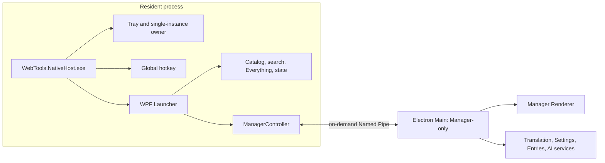

# WebTools Native Launcher Phase 4D — Integration Report

**Date:** 2026-09-29
**Branch:** `codex/shared-ai-translation-2.0`
**Status:** Implementation and automated checks are complete. Windows acceptance is **partially verified**; UI-driven stress and handoff cases remain manual. No commit, push, PR, installer replacement, or Phase 4E work was performed.

## 1. Executive Summary

Phase 4D now has a Native Host-owned resident Launcher and an Electron Manager-only mode that starts on demand. A versioned, length-prefixed Named Pipe carries typed commands and snapshots. Native Host owns Launcher preferences, the saved-website search projection, application search memory, and the catalog snapshot. Electron DataStore remains the full website CRUD and Manager-only settings store.

Static checks, 109 Node tests, 21 Native checks, Electron build, and Native Host Release publish pass. A live pipe probe verified handshake and safe rejection of malformed application-memory data without losing the connection. A Manager-only process group was observed while Native Host was running; after stopping the pipe owner, the Electron process count returned to zero. This validates the disconnect-exit path, not the ordinary Manager close button or repeated open/close behavior.

Code review found and fixed a renderer-readiness race, an unbounded retry loop after missing acknowledgements, the app-memory null-payload failure, and a website projection envelope mismatch. The retained legacy Electron Launcher can still read stale Launcher preferences and app-search memory after Manager-only changes; it is documented below rather than introducing a second writer to DataStore.

## 2. Final Process Architecture

The intended idle state is one Native Host and zero Electron processes. Manager use adds an Electron process group; ending the Manager or losing the Native pipe should return Electron to zero while the Host remains alive.

## 3. Manager-only Electron Mode

`--manager-only` (also selected by the internal environment flag) skips the Electron Launcher BrowserWindow, Launcher renderer/preload, Electron global hotkey, and Electron tray. It creates the Manager window and initializes Manager services only after the Native pipe handshake. The old Electron Launcher path remains buildable as fallback/reference.

The Manager still initializes its own app catalog for Manager search. That catalog is separate from the resident Native Launcher catalog and is not loaded while Electron is absent.

## 4. Native Manager Controller

`ManagerController` owns one process reference, latest-wins pending navigation/translation intent, launch serialization, ready waiting, acknowledgement handling, process exit observation, and bounded shutdown. Opening Search, Entries, Settings, or Translation reuses a live Manager process; an exited process is eligible for a later relaunch. A failed launch clears the affected pending intent and reports a bounded error without stopping Native search.

The pending intent is latest-wins while Manager starts. Once dispatch begins, a matching acknowledgement clears only that intent. An unacknowledged request remains available for a later readiness cycle or a newer user request.

## 5. Named Pipe Protocol

Native Host is the server and Electron Manager is the client. Protocol version is `1`; messages use a four-byte little-endian length prefix and a 4 MiB body limit. Request IDs are bounded and deduplicated per session. Implemented message types include `hello`, renderer ready/not-ready, `open-page`, `translation-prefill`, `launcher-settings-update`, `websites-update`, app-memory get/remember, `shutdown-manager`, and acknowledgements/errors.

## 6. Protocol Security

The pipe uses `PipeOptions.CurrentUserOnly`; payloads must be JSON objects; the protocol has fixed message types and does not accept arbitrary executable commands. Settings, URLs, app-memory IDs, request IDs, frame size, and version are validated before persistence or dispatch. Invalid JSON or frames terminate that session, and the server loop is designed to accept another connection.

The hello payload checks that its claimed process ID is positive but does not compare it with the OS-reported pipe client PID. The pipe also has no separate pre-hello idle deadline. The current-user ACL limits this to the same Windows account; process identity verification and a handshake deadline remain hardening opportunities.

## 7. Ready Handshake

Manager reports renderer readiness from its mounted app. Main reports navigation as not-ready and resets renderer-dependent queues. Native Host waits on a readiness signal, not a fixed startup delay. `ManagerRendererReadiness` now completes the captured old signal on navigation before replacing it, so the first caller cannot remain stranded on a task that no later ready event will complete.

Automated regression checks cover a waiter captured before navigation, the replacement readiness generation, and a subsequent ready event. End-to-end visible readiness still needs manual confirmation.

## 8. Pending Intent Semantics

Repeated page/prefill requests queued during Manager startup replace the prior request (latest-wins); this avoids replaying stale translation text. Request IDs identify each intent, and only its matching renderer acknowledgement clears it. A timeout with no renderer generation change no longer starts an immediate retry loop. A newly queued intent or completed readiness cycle may trigger another attempt.

## 9. Translation Handoff

The path is Native Launcher → Native Host → ManagerController → Named Pipe → Electron Main → Manager Renderer → `TranslateView`. Main validates non-empty translation text up to 20,000 characters; the prefill is not written to diagnostics. Renderer acknowledgement occurs only after the matching prefill is applied. Existing `TranslateView` cancellation/stale-result protection remains in place, and a prefill does not itself request a provider translation.

Cold and warm UI handoffs were not exercised in this environment; see Sections 24 and 29.

## 10. Launcher State Ownership

Native `LauncherStateStore` is authoritative for hotkey, theme, Launcher display mode, login-startup preference, search engines, Everything preferences, the website search projection, and the bounded app-search memory. It excludes API keys, provider tokens, translation secrets, and other Manager-only credentials.

Electron DataStore remains authoritative for the complete Manager website records, folders, AI/provider configuration, translation settings, and other Manager-only data.

## 11. State Migration

The Native state schema is version 1. First start imports the Launcher-required fields from the existing version-2 Electron data file when a Native state file is absent; subsequent starts load Native state. Writes use a temporary file and replacement/backup path. Development Host uses `%APPDATA%\WebTools-Dev`; packaged Host uses `%APPDATA%\Nook`.

Checks cover one-time import and reload. Invalid snapshot files fall back to a catalog scan. Production migration against an existing user install and rollback/recovery still merit manual validation before release.

## 12. Website Ownership

Electron remains the full website-record owner. Manager CRUD saves the canonical DataStore record first, then sends a reduced object envelope `{ websites: [...] }` to Native Host, which persists only the Launcher search projection. `WebsiteEntry`/full website persistence schema was not changed.

The object envelope mismatch found during live testing was fixed in Electron projection and Native deserialization. A read-only handshake and website-count probe confirmed the current development projection remains one entry.

## 13. Search Engine Synchronization

Manager changes search engine records/default through a typed Native update. Native validates the complete candidate state, persists it, and applies it to the live Launcher without restart. Runtime selection/search after editing was not manually performed in this pass.

## 14. Hotkey Transaction

Native attempts to register a new shortcut before persisting the new setting. Registration failure rejects the update and retains the previous shortcut; persistence failure restores prior runtime registration/startup state where applicable. This is covered by the implementation path but was not exercised through the Settings UI in this pass.

## 15. App Search Memory

App memory is normalized, bounded to the newest 100 entries, persisted in Native state, and keyed by stable catalog ID. Renderer sends only an app ID and query; Native never receives a filesystem path. Missing/stale IDs cannot launch a different app and simply fail to promote a current result. New pipe validation rejects null, blank, oversized, and malformed updates; a live malformed request was rejected while the pipe continued serving a subsequent read.

## 16. App Catalog Snapshot

Snapshot path: `%LOCALAPPDATA%\WebTools\app-catalog.v1.json`. It stores schema version, generation time, and validated catalog records. Load rejects missing/corrupt/oversized/invalid entries; invalid or missing snapshots fall back to the full scan. Save writes a temporary file and atomically replaces the prior snapshot with a backup. Startup loads a valid snapshot and builds search before a background catalog refresh; no periodic scan was added.

## 17. Startup Performance

The Phase 4C full application scan previously measured about 15.4–16.2 seconds for 286 merged apps. This pass measured the cached app-search initialization path in five fresh .NET processes, reading the existing 286-app snapshot:

| Measurement | Five-run range |
|---|---:|
| Snapshot deserialize and validation | 40.07–41.26 ms |
| Catalog restore | 1.37–1.65 ms |
| App search-index construction | 19.30–19.65 ms |
| First `visual` query | 10.97–11.63 ms |
| Snapshot + restore + index | 61.00–62.27 ms |

This is an isolated core benchmark, without WPF dispatcher/render time and with an empty website index; it is not an end-to-end keypress-to-visible-result measurement. It shows the cache/index path is about 0.06 seconds before the first query on this machine, compared with the earlier 15.4–16.2 second full scan. The older Phase 4B/4C process-start-to-hotkey-ready sample was 437.576 ms; this pass did not capture a new combined host-to-visible-result timing.

## 18. Manager Navigation

The Host can request Search, Entries, Settings, or Translation. Electron Main reuses one Manager BrowserWindow and focuses it, then renderer state switches the existing `App.vue` section. No Vue Router or extra Manager window was introduced.

## 19. Crash Recovery

Manager process exit clears its process reference; Native Host remains independent, and a future explicit Manager request can launch another process. Electron also exits after Native pipe disconnect. A pipe-owner shutdown smoke confirmed the Electron count returned to zero. A Manager-only forced-crash/reopen test while preserving the Host was not performed.

## 20. Shutdown

Tray Exit asks Manager to shut down through the pipe, waits up to eight seconds, then terminates the process tree only if needed, before Native cleanup. Manager-only BrowserWindow close destroys that window and exits Electron. These ordinary UI shutdown paths were reviewed statically, not exercised with a mouse in this pass.

## 21. Development and Release Paths

Development locates the repository from the configured root/base directory, invokes the current Node executable and `electron-vite dev`, and passes Manager-only and pipe flags. It does not depend on the shell's `npm` PATH or publish Electron first. Release resolves an explicit Manager executable override, a Manager subfolder beside the Host, a same-directory executable, the current per-user install location, or known `release/win-unpacked` ancestors. No user-specific absolute path is hard-coded. Final installer layout remains outside Phase 4D.

## 22. Process Tree Validation

Observed in one local run:

| State | Observation |
|---|---|
| Native Host idle before Manager launch | Native Host present; Electron count observed as zero |
| Manager-only invocation | One Electron process group appeared (four `electron.exe` PIDs were visible in the process list) |
| Native pipe owner stopped | Electron process count returned to zero |

The final row validates Manager’s pipe-disconnect exit behavior. It is not a normal Manager-window-close test. No 30-cycle stress run was performed. Process metadata access was restricted for some child PIDs, so the exact helper-role breakdown is not asserted.

## 23. Manager Open/Close Stress

The requested 30 open/close cycles, duplicate-manager check, and orphan-process sweep remain **NEEDS MANUAL VERIFICATION**. One on-demand process-group lifecycle was observed as described above.

## 24. Translation Cold/Warm Tests

The 10 cold-start prefills and 30 warm prefills—including latest-text, focus, duplicate-request, and page-switch checks—remain **NEEDS MANUAL VERIFICATION**. Automated tests cover the typed command and translation prefill queue/request lifecycle, but do not substitute for the Windows Manager UI.

## 25. Settings Sync Tests

Hotkey, selected search engine, add/edit/delete website, restart persistence, and immediate Launcher behavior were not driven through the Manager UI here. Code paths and Native state tests pass; full settings-sync acceptance remains **NEEDS MANUAL VERIFICATION**.

## 26. Memory Results

No reliable before/after Manager memory comparison was collected in this pass. A prior one-run Native idle observation after catalog initialization was about 79 MB Private Bytes and 155 MB Working Set, with no material change over the next 30 seconds; this is a single short sample, not a leak conclusion or a Phase 4D A/B. Electron process count is the stronger acceptance metric and returned to zero after pipe-owner exit.

## 27. Resource Observation

No new 10-minute idle, GDI/USER handle trend, or 30-cycle measurement was collected. Phase 4C recorded one unexplained 10-minute Private Bytes/GDI increase that did not recur in its next two runs; that uncertainty remains open and is not attributed to a leak here.

## 28. Known Limitations and Review Findings

- **P2 — Retained Electron fallback data can be stale.** Manager-only Launcher preferences and app-memory are written to Native state. The legacy Electron Launcher fallback reads those fields from DataStore. Mirroring them into DataStore would create a second writer or require a separate import/read policy, so no synchronization change was made. Before relying on the fallback after Native Manager edits, define a one-way compatibility read/import or explicitly treat fallback as development/reference only.
- **P2 — Pipe client identity is same-user scoped, not process-authenticated.** `hello.processId` is validated as positive but is not compared to the OS pipe client PID. Current-user ACL and typed fixed commands limit exposure to the same account, but process identity and a pre-hello deadline are future hardening items.
- **Manual acceptance gaps:** normal Manager close, Manager crash/reopen, cold/warm translation handoff, UI settings synchronization, and 30-cycle process stress.
- No dependency was added; Electron Launcher source, user website schema, translation providers, and UI design were not removed or redesigned.

## 29. User Manual Validation

Please verify on Windows before treating Phase 4D as accepted:

- [ ] Cold start Native Host with Electron absent; use hotkey to search apps, Chinese/pinyin/initials, websites, `?`, and `file:`.
- [ ] Open Settings, Entries, and Translation from the tray; confirm only one Manager window/process group.
- [ ] Close Manager normally and confirm Electron PIDs return to zero while the tray/Launcher remain usable.
- [ ] Repeat Manager open/close 30 times and inspect for orphan/duplicate Electron processes and Native memory/resource growth.
- [ ] Run 10 cold Translation handoffs and 30 warm handoffs; verify exact latest text, no auto-translation, correct page/focus, and no stale overwrite.
- [ ] Change hotkey and search engine; add/edit/delete websites; verify immediate Launcher updates and persistence after Native Host restart.
- [ ] Terminate Manager unexpectedly; confirm the Native Host remains searchable and a later Manager request succeeds.
- [ ] Verify release executable discovery after the installer layout is finalized.

## 30. Phase 4E Readiness

The primary/secondary process architecture and on-demand protocol are implemented. Automated checks pass, and one live pipe/process smoke was successful. **Phase 4D should remain in manual acceptance rather than be declared fully closed** until Sections 23–25 and the normal Manager close/restart checks are completed. The fallback compatibility decision in Section 28 should also be settled before the old Electron Launcher is treated as a dependable rollback path. No Phase 4E implementation has started.

## Required Answers

### Q1 — Can Native Launcher work after Windows cold start without Electron?

Yes by the current startup architecture: Native Host initializes the WPF Launcher, hotkey, Native catalog/search, websites, and Everything without launching Electron. The local idle process snapshot showed no Electron. Phase 4C already recorded user verification of Launcher search; this pass did not repeat keyboard-driven GUI searches.

### Q2 — How much does the catalog snapshot improve search-ready time?

The isolated cached path took 61.00–62.27 ms for snapshot load, catalog restore, and app index build across five fresh .NET processes, followed by a 10.97–11.63 ms first query. The earlier uncached full scan took about 15.4–16.2 seconds. Exact end-to-end WPF keypress-to-visible-result timing was not captured in this pass.

### Q3 — What starts Electron?

Only Manager actions: tray Open/Search, Entries, Settings, Translation, and a Launcher Translation action. App, website, web-search, and Everything search/launch are Native/shell paths and do not require Electron.

### Q4 — Does Electron reliably return to zero after Manager closes?

One process group returned to zero after the Native pipe owner stopped. Normal Manager window close was not tested; stability across repeated closes remains unverified.

### Q5 — Were 30 Manager open/close cycles free of orphans/duplicates?

Not tested. **NEEDS MANUAL VERIFICATION.**

### Q6 — Did cold Translation prefill pass 10/10?

Not run. **NEEDS MANUAL VERIFICATION.**

### Q7 — Was warm Translation handoff stable with Manager already open?

Not run in the UI. **NEEDS MANUAL VERIFICATION.**

### Q8 — Are Hotkey, Website, and Search Engine changes immediate, persistent, and restart-safe?

Implementation and persistence paths are present and Native state tests pass. Manager UI end-to-end immediate/restart behavior was not tested; do not mark this 3-part acceptance as passed yet.

### Q9 — Who owns Launcher state, and what remains Electron-owned?

Native Host owns Launcher preferences, hotkey, website search projection, app-search memory, and catalog snapshot. Electron DataStore owns full website records/folders, translation and AI settings, and secrets. Website projection is a one-way Manager-to-Native update after DataStore CRUD.

### Q10 — Does Native startup require Electron to run first?

No. The Native Host starts without Electron; no Electron initialization is in its startup dependency chain.

### Q11 — Does Native Launcher continue after a Manager crash?

The process and service boundaries are designed so it does. A Manager crash/reopen was not injected during this pass; runtime confirmation remains manual.

### Q12 — Is the target architecture present?

The Native primary / on-demand Electron Manager architecture is present in code and one process lifecycle smoke. Full Phase 4D acceptance is still pending the Windows UI and stress checks listed above.

### Q13 — What blocks Phase 4E?

Complete normal Manager close and 30-cycle process validation, cold/warm Translation handoff, settings synchronization/restart validation, and Manager crash/reopen. Decide whether the legacy Electron fallback must remain data-current after Native Manager changes; no dual-writer workaround was added.

## Validation Results

- `vue-tsc --noEmit -p tsconfig.web.json`: PASS.
- `tsc --noEmit -p tsconfig.node.json`: PASS.
- Node test suite: PASS, 109/109.
- Electron `electron-vite build`: PASS.
- Native Host checks: PASS, 21/21.
- Native Host Release `dotnet publish`: PASS.
- Live Named Pipe: handshake PASS; null app-memory rejected as `INVALID_APP_MEMORY`; subsequent app-memory query PASS.
- `git diff --check`: PASS; the report has no trailing whitespace.
