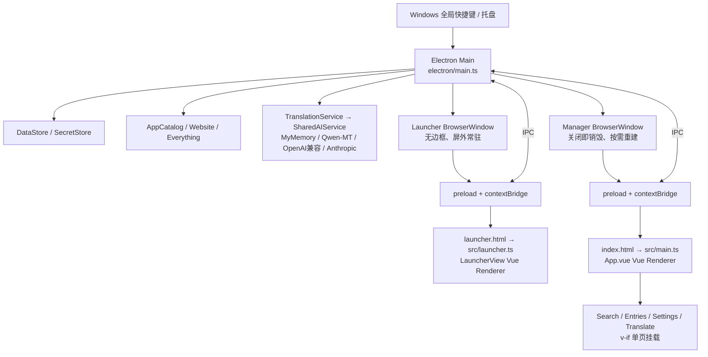
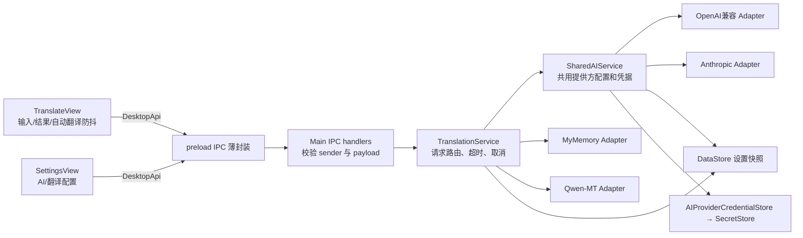

# WebTools 重构前架构与性能审计

审计日期：2026-09-28。范围：当前工作区的 Electron Main、preload、两个 Vue 入口、Translation 2.0、持久化、IPC、现有 `out/` 构建快照。**本报告只依据静态代码和现有构建文件；没有启动应用、采集进程内存或执行压力测试。** 文中的“已确认”表示代码路径确定，不表示内存收益已实测；涉及操作系统进程数、实际占用和泄漏趋势的判断均标为“需要运行时验证”。本阶段未修改产品代码。

## 1. 当前运行架构

**窗口数与生命周期。** `createLauncherWindow()` 和 `createWindow()` 是仅有的两个 `new BrowserWindow` 调用；没有 BrowserView、WebContentsView 或额外 `webContents` 的创建路径（`electron/main.ts:69,186`；全项目搜索）。手动启动在初始化结束后创建 Launcher 和 Manager，预期两个窗口、各自一个页面 WebContents；带 `--hidden` 登录启动只创建 Launcher（`electron/main.ts:399-400`）。Manager 关闭后只剩 Launcher；再次打开重建 Manager。这里说的 Renderer 是页面实例：**一到两个页面 Renderer**。Windows 任务管理器里究竟有几个 Renderer/GPU/Utility **OS 进程**，需运行时确认，不能由窗口数推断。

| 操作 | 代码路径 | 结果 |
| --- | --- | --- |
| Launcher 初建 | `electron/main.ts:184-227` | `show:false` 建立后移到 `(-32000,-32000)` 并 `showInactive()`，WebContents 保持存活。|
| Launcher 收起、Esc、失焦 | `electron/main.ts:229-235,215-217`；`src/features/search/LauncherView.vue:117-125` | 更新 `launcherShown` 并移到屏外；**未调用 Electron `hide()` 或销毁**。|
| Launcher 再唤出 | `electron/main.ts:245-264,289-312` | 复用同一窗口、重新定位和聚焦；不存在正常 Toggle 每次创建窗口。|
| Manager 展示 | `electron/main.ts:66-121` | 活窗口复用；没有窗口或已销毁则创建。`ready-to-show` 后显示。|
| Manager 关闭 | `electron/main.ts:96-108` | 非退出路径拦截 `close` 并调用 `destroy()`；`closed` 清空引用、取消翻译/连接测试。因此相应 WebContents 应随窗口销毁，**实际 OS 工作集回落需要运行时验证**。|
| 应用退出 | `electron/main.ts:407-415` | 保持托盘常驻；真正退出时释放全局快捷键和 Tray。|

`showManager()`、`createLauncherWindow()` 的存活检查防止正常路径重复建窗（`electron/main.ts:67,119,185`）。Manager 的短暂 `show:false` 是加载阶段，不是长期隐藏缓存；Launcher 才是长期屏外保留的窗口。`backgroundThrottling:false` 只设置在 Launcher（`electron/main.ts:200`），它保持响应性，但也让屏外页面不享受背景节流。当前未发现常驻 `setInterval`。

## 2. Launcher 与 Manager 的代码载荷

Launcher 使用单独的 `launcher.html → src/launcher.ts → LauncherView.vue` 入口，静态引入 Vue、`@lucide/vue` 中使用到的图标、`pinyin-pro` 搜索索引、搜索结果模型、书签对话框、Favicon 和主题（`src/launcher.ts:1-20`；`src/features/search/LauncherView.vue:1-26`）。**没有静态引入** Manager 的 `App.vue`、SettingsView、TranslateView 或任何 Main 侧 Provider；preload 虽暴露完整 `DesktopApi`，其代码是 IPC 封装，不会把 Main 的 Translation Service 打进 Launcher Renderer（`electron/preload.ts:1-60`）。

Launcher 的长期状态包括应用目录、全部已存网址及其可能的 base64 favicon、搜索索引、有限的当前结果图标、`ResizeObserver` 与主题媒体查询监听器（`LauncherView.vue:30-70,83-115,172-183`；`src/shared/theme.ts:1-33`）。`expanded` 为假时快捷内容的 DOM 因 `v-if` 不存在，但 `websites` 数组仍驻留（`LauncherView.vue:374-389`）。每次唤出调用 `load()`，重新通过 IPC 取全量应用和网址；首次 mounted 也调用一次，两个异步取数可能重叠（`LauncherView.vue:113-115,328-350`）。由于 `entries` 和拼音索引依赖这两个数组，重新赋值会使索引失效并在下次读取时重建（`LauncherView.vue:66-76`；`src/shared/pinyin-index.ts:17-33`）。这是可测量的分配与唤出延迟候选，**尚不能称为泄漏**。

Launcher 的事件清理总体有边界：`webtools-launcher-show` 在卸载时移除，`ResizeObserver` 在复用/卸载时断开；拖动用的 `pointermove/up/cancel` 在结束拖动时移除（`LauncherView.vue:172-183,198-226,345-360`）。在“拖动尚未结束就卸载组件”的边缘路径，卸载钩子没有显式移除三种 pointer 监听；正常产品路径下 Launcher 组件不因窗口收起而卸载，窗口销毁又会带走整个 JS 上下文，未据此认定持续泄漏。

Manager 为**单个 Renderer、四个页面组件**，没有 Vue Router、`KeepAlive`、独立 Translation 窗口或全局页面 Store。`App.vue:8-11` 静态导入四页；`App.vue:119-122` 用 `v-if/else-if` 切换，切走会卸载旧组件。`SearchView` 挂载时读取应用、网址和设置，卸载时清理 document `pointerdown`；`EntriesView` 仅在进入时读取网址；`SettingsView` 仅在进入时取设置、AI 状态、Everything 状态；`TranslateView` 仅在进入时取语言设置和 Provider 信息（`src/features/search/SearchView.vue:125-145,253-258`；`src/features/entries/EntriesView.vue:17-24,90`；`src/features/settings/SettingsView.vue:246-263`；`src/features/translate/TranslateView.vue:84-103`）。页面实例可卸载，但**静态导入的页面模块代码依然随 Manager 首次加载**。现状已经满足“单 Renderer + 多页面”的窗口架构，尚未做到“各功能模块按需加载”。

## 3. Translation 2.0 依赖与职责

`TranslationService`、`SharedAIService` 和四个 Provider Adapter 均由 Main 在启动时构造并长期持有（`electron/main.ts:357-370`）。**实例是急切创建的，但网络连接/翻译请求不是启动时发起**；Adapters 没有周期计时器或页面引用（`electron/services/{mymemory-adapter,qwen-mt-adapter,openai-compatible-adapter,anthropic-messages-adapter}.ts`）。`SharedAIService` 读取共用设置与凭据、按协议选择 Adapter，不依赖翻译 UI，未来可被其他 Main 侧功能复用（`electron/services/shared-ai-service.ts:31-114`）。`SecretStoreCore` 每次按需读/解密，不持有长期明文 Key 缓存（`electron/services/secret-store-core.ts:14-93`）。

每次翻译创建 `AbortController` 与 45 秒超时，放入 `active Map`，完成时在 `finally` 清理；页面切走的 `onBeforeUnmount` 会取消当前请求；Manager 关闭/导航以及 AI/翻译设置更新也会取消活动请求（`electron/services/translation-service.ts:39-114`；`TranslateView.vue:98-103`；`electron/main.ts:54-57,96-102`；`electron/ipc/settings-handlers.ts:113-115`）。AI 连接测试使用独立 `Set<AbortController>` 和 30 秒超时，`finally` 删除，Manager 结束时批量 abort（`electron/ipc/translation-handlers.ts:26-99`）。Provider 的 `fetch` 都传入同一取消信号；回复 JSON 当前由 `response.json()` 读取，具体峰值取决于服务端返回大小，宜在基线中覆盖异常大响应场景（`electron/services/ai-provider-errors.ts:20-23`）。

Translation UI 承担输入状态、自动触发、防抖、语言偏好保存、剪贴板提示和请求代际门控；服务选择、凭据及网络调用留在 Main。它不是单纯展示组件，但当前职责没有越过 IPC 边界。静态导入图检查覆盖 `src/` 与 `electron/` 下 66 个 `.ts/.vue` 文件、176 条可解析相对/`@/` 导入边，未发现静态循环依赖；运行时动态模块或第三方包内部的循环未覆盖。**唯一明确的生命周期竞态见问题 R4**。

## 4. Main / preload / Renderer 边界与资源盘点

| 层 | 当前职责 | 审计判断 |
| --- | --- | --- |
| Main | BrowserWindow/Tray/Hotkey；目录扫描、DataStore/SecretStore、Provider、外部打开、Everything；IPC 注册。 | 服务单例在 `app.whenReady()` 内建一次，Handler 也只注册一次（`electron/main.ts:341-400`）；未见重复 `ipcMain.handle/on` 注册路径。Main 还保存少量 UI 协调状态：Launcher 位置/显示、Manager 引用与翻译预填队列。这些是窗口协调，不是完整页面状态。|
| preload | `contextBridge` 暴露 `window.desktop`，以 invoke/send 转发、校验预填事件结构，并返回取消订阅函数（`electron/preload.ts:1-60`）。 | 无目录扫描、网络请求、定时器或业务缓存；两个窗口均装载同一个宽接口。若未来收窄权限可拆表面，但不能以此推断当前内存问题。|
| Renderer | Vue 页面状态、交互、搜索索引/过滤、可见应用图标请求、主题应用。 | `contextIsolation:true`、`nodeIntegration:false`、`sandbox:true`，未发现 Renderer 直接读取 Node 文件系统（`electron/main.ts:78-83,200`）。翻译的长期请求和凭据留在 Main。|

Launcher → Manager 的预填通过有界文本、Main 的单个 pending request、`managerReady` 和匹配 ID 的 acknowledge 完成；App.vue 在 mounted 订阅、unmount 取消（`electron/main.ts:124-162`；`electron/services/translation-prefill.ts:1-44`；`src/App.vue:39-53`）。pending 最多一条、文字至多 20,000 字符；未 ack 时可保留到后续 Manager ready 或进程退出，属于有界状态。翻译及 AI IPC 用 Main 窗口主 frame 校验；`window:move-launcher-by` 也验证 sender（`electron/ipc/translation-handlers.ts:26-99`；`electron/main.ts:274-287`）。窗口 API 的部分普通显示/尺寸调用只做数值校验、未统一校验 sender（`electron/ipc/window-handlers.ts:15-33`）；这是边界收敛候选，**没有证据表明它造成内存增长**。`DesktopApi` 按操作暴露多个窄 IPC 方法；虽数量较多，没有发现由此带来的重复 Handler 或轮询，现阶段不建议仅为减少通道数而合并接口。

| 资源类别 | 具体实现与释放路径 | 结论 |
| --- | --- | --- |
| `setInterval` / 观察器 | 业务源代码无 `setInterval`、MutationObserver、IntersectionObserver；Launcher 有一个复用的 ResizeObserver，卸载断开。 | 未发现周期轮询泄漏。|
| 定时器 | Translation 自动翻译 450ms、偏好保存 180ms 都在卸载清理；Main 翻译 45s、连接测试 30s 都在完成时清理；文件搜索 160ms、提示 1.5/1.8s 为一次性。 | 大多数有清理/代际保护；短提示 timer 在卸载后可短暂留住闭包，收益低。|
| 事件监听 | App.vue 预填订阅在卸载取消；SearchView document pointerdown 卸载移除；主题媒体监听在 `applyTheme` 再调用时先移除旧监听；Launcher 拖动/显示监听见第 2 节。 | 未发现反复 Toggle 注册新 IPC/DOM 长期监听。|
| `watch` / `computed` | Vue 组件 setup 内使用，组件卸载时作用域释放；Launcher 因组件常驻而计算状态常驻。 | `watch` 本身不是泄漏；索引和深 watch 的成本要结合数据量测量。|
| Map / Set / WeakMap | AppCatalog `records`/`icons` 长期持有；Translation `active` 请求完成删除；Everything `resultPaths` 每次搜索替换；Main 的 Launcher readiness 为 WeakMap；连接测试 Set 完成删除。 | 主要长期增长候选是应用图标缓存，详见 R3。|
| 图片 / Blob / Buffer | 收藏 favicon 为最多 500,000 字符的 data URL，可在 Store、IPC 快照、各 Renderer 中出现；应用 icon 按 ID 懒取并缓存。元数据抓取页面与 icon 响应分别限制 512/256 KiB；无 `Blob`/ObjectURL 创建。 | 收藏数据复制与解码图片占用需要运行时测量，详见 R2。|

## 5. Bundle 与依赖快照

`electron.vite.config.ts:1-20` 定义 Main、preload、Manager HTML、Launcher HTML 四个入口；源码未使用 `import()` 或 `defineAsyncComponent`。依赖仅 Vue、`@lucide/vue`、`pinyin-pro`，没有发现可断言为重复引入的大型业务库。Manager 与 Launcher 都用 `pinyin-pro`，并共享构建 chunk；Launcher **没有加载** Main 的翻译 Provider。现有本地 `out/renderer/assets` 快照的磁盘大小如下（文件时间 2026-09-28 01:55；这**不是** JS heap 或实际内存）：

| 资源 | 大小（原始字节） | 静态含义 |
| --- | ---: | --- |
| `tokens-BTi44Ld0.js` | 655,040 | 两个页面入口共享的依赖/工具 chunk，文本中包含 Vue 和拼音相关代码；各库真实占比需 bundle analyzer。|
| `index-Da5bGP0T.js` | 135,737 | Manager 入口，静态包含 Search、Entries、Settings、Translate 页面代码。|
| `launcher-BxDwktu0.js` | 35,525 | Launcher 入口。|
| `tokens-CTe298EE.css` | 49,941 | 共用样式；两个页面加载。|
| `index-S1CnedOF.css` | 3,539 | Manager 入口样式。|
| Main / preload JS | 127,242 / 6,724 | Main 服务代码 / preload IPC 包装。|

这些快照可能因后续重建而变化，不能把文件大小直接换算成驻留内存。`@lucide/vue` 采用命名图标导入，是否存在异常整体打包以及 `pinyin-pro` 与 Vue 各自体积，需要 Phase 0 的可重复 bundle 分析再决定；当前不建议删除依赖。

## 6. 风险清单

等级按本审计的证据而非想象中的 MB 划分。**P0：未发现静态代码可确定的持续泄漏或重复建窗。** 以下“已确认”仅表示持有/调用路径在代码中成立；内存影响仍需运行时验证。

### R1 · P1 · Launcher 屏外常驻形成内存下限

- **位置/代码：** `electron/main.ts:184-235,399-400`，`showInactive()` 后收起只执行 `setPosition(-32000,-32000)`；`backgroundThrottling:false` 在第 200 行。
- **当前行为/原因：** 即使登录后只在托盘空闲，Launcher 的 BrowserWindow、WebContents、Vue、preload 与搜索状态仍活着。这是为无淡出动画和快捷键低延迟保留的既有产品决策，**不是泄漏**，但构成显著常驻基线。
- **确认/验证：** 持有路径已确认；比较 A/B/K 阶段的窗口、Renderer/进程、JS heap 和唤出 p95 延迟，才可判断可削减的成本。
- **方向/风险/收益：** 先测量，再优先减少该 Renderer 持有的数据与初始化；仅在有等价交互/延迟验证后考虑改变窗口承载方式。改变 show/hide 容易重新引入 Win11 动画或冷唤出迟滞，修改风险**高**；潜在相对收益**高**。

### R2 · P1 · 全量收藏网址与 data URL favicon 跨进程复制

- **位置/代码：** `electron/services/data-store.ts:96-138` 的 `AppData` 常驻与 `structuredClone`；`electron/services/website-service.ts:12-24` 的列表/单图标 500,000 字符限制；`src/features/search/LauncherView.vue:30-33,113-115` 的全量列表；`src/features/search/SearchView.vue:125-145`、`src/features/entries/EntriesView.vue:17-24` 的 Manager 列表；`LauncherView.vue:374-389` 的按展开才挂 DOM。
- **当前行为/原因：** Main 持有完整网站数据；Launcher 在未展开甚至屏外时仍持有完整列表。Manager 的活动页面可再通过 IPC 得到列表及 favicon 字符串。单条限制存在，但站点数没有由该路径限制；实际额外内存与站点数/图标大小有关。拷贝和图像解码成本不能简单相加推断 MB。
- **确认/验证：** 多份全量数据路径已确认；用固定的 0/50/200 个收藏、相同 favicon 尺寸做 B/C/G/H/K 阶段对照，配合 heap snapshot、DOM 图像资源与私有工作集；**需要运行时验证**收益。
- **方向/风险/收益：** 后续可考虑只给 Launcher 发送搜索/展示所需摘要、图标按可见项加载并复用；保持现有 `WebsiteEntry` 持久化 schema 与打开行为。改 IPC 形状/渲染可能出现图标闪烁或搜索回归，风险**中至高**；相对收益**中至高（取决于数据量）**。

### R3 · P2 · 应用图标缓存按目录 ID 增长至整个目录规模

- **位置/代码：** `electron/services/app-catalog.ts:15-16,43,49-89`，`icons: Map<string, Promise<string|null>>`；`src/features/search/use-app-result-icons.ts:5-23`。
- **当前行为/原因：** Main 仅在可见结果请求时解析图标，符合懒加载；已请求的 data URL Promise 在下一次 `refresh()` 前不淘汰。上界是当前 catalog ID 数，不是无穷泄漏，但长时间搜索不同应用会抬高 Main 内存；Renderer 只保留当前可见 ID 的图标。
- **确认/验证：** 缓存留存路径已确认；在 B/K 阶段依次搜索覆盖大量不同应用，记录 cache 条数（未来诊断钩子）、Main heap/私有字节、刷新前后差异。实际增长**需要运行时验证**。
- **方向/风险/收益：** Phase 1 可评估按字节预算/LRU 或缩小图标 payload；需保持图标即时命中与正确性，风险**中**；相对收益**中**。

### R4 · P2 · 翻译页异步初始化可能越过卸载边界

- **位置/代码：** `src/features/translate/TranslateView.vue:76-103`。`onMounted` 等待设置和 Provider 信息，`onBeforeUnmount` 清 timer 并设 `settingsReady=false`，但 mounted 的 `finally` 可在卸载后再设为 `true` 并调用 `scheduleAutoTranslate()`。
- **当前行为/原因：** 若进入 Translation 时已有文本，且切走时初始化尚未完成，较晚完成的初始化可能在已卸载组件上安排 450ms timer，进一步启动网络翻译。请求最终受 Main 的 45s 超时约束，但会造成短期无谓对象/请求，重复切页时可重现；**不是已证明的无限期泄漏**。
- **确认/验证：** 条件竞态由代码顺序确认；需在慢 IPC/慢凭据读取条件下切页，记录卸载后 `translate:run` 次数和在途 Map 大小，确认真实触发频率。
- **方向/风险/收益：** 用组件存活标志/代际门控 mounted 回调与 timer 调度，保留自动翻译语义；风险**低至中**，相对内存收益**低至中**，正确性收益更直接。

### R5 · P2 · Launcher 每次唤出重取全目录并使索引重建

- **位置/代码：** `src/features/search/LauncherView.vue:66-76,113-115,328-350`；`src/shared/pinyin-index.ts:17-33`。
- **当前行为/原因：** 唤出时 `void load()`，mounted 时也 `void load()`；全量 IPC payload 到 Renderer、重新赋值、下一次使用时重建拼音索引。即使数据未变化也会发生。主要是短期分配、唤出 CPU/延迟和 GC 压力，未见持续累加。
- **确认/验证：** 调用路径已确认；测首次与第 2～100 次唤出 p50/p95、IPC 调用次数/字节、heap 锯齿与 GC，**需要运行时验证**实际体验影响。
- **方向/风险/收益：** 建立版本/变更通知或带有效期缓存，避免无变化全量复制；要保证在 Manager 新增网址/刷新应用后立即可见，风险**中**；相对收益**中**。

### R6 · P2 · Manager 页面卸载了，但页面代码未按需加载

- **位置/代码：** `src/App.vue:8-11,119-122` 静态导入与 `v-if`；`electron.vite.config.ts:14-20` 多入口但 Manager 内无动态页边界。
- **当前行为/原因：** Manager 窗口只占一个 Renderer，切页释放页面实例；首次进入时所有页面模块代码已进入 Manager bundle。问题是首次加载和代码常驻，不是四份独立 Renderer。
- **确认/验证：** 打包图与源导入已确认；以 C/D 前后的 Manager 启动时间、解析执行时间、JS heap 与 bundle analyzer 看可回收部分，**需要运行时验证**收益。
- **方向/风险/收益：** Phase 4 在保留单 Renderer 和页面卸载行为下逐页引入异步组件；注意切页加载状态和 Translation prefill 交付顺序，风险**中**；相对收益**中**。

### R7 · P2 · 启动前同步等待完整应用目录扫描

- **位置/代码：** `electron/main.ts:372-400` 的 `await appCatalog.refresh()` 先于 Tray、Hotkey、Launcher 创建；`electron/services/windows-app-source.ts:26-84,87-127` 的递归 `.lnk`、PowerShell StartApps/App Paths；`electron/services/app-catalog.ts:18-46`。
- **当前行为/原因：** 目录扫描、快捷方式解析及两个外部 PowerShell 查询完成后，快捷键/窗口才注册。这主要威胁冷启动就绪时间和扫描期峰值，不是持久泄漏。
- **确认/验证：** 顺序已确认；记录 A 阶段从进程启动到托盘、快捷键可用、Launcher ready 的时间，并区分文件/PowerShell 各段，**需要运行时验证**瓶颈。
- **方向/风险/收益：** 可评估先建立可用入口再异步刷新目录并通知 Renderer；需保证启动初期搜索结果/快捷键语义与错误处理，风险**中至高**；相对收益对内存**低**、对冷启动**中至高**。

### R8 · P3 · 翻译/设置提示短 timer 与 Provider 急切实例化

- **位置/代码：** `src/features/translate/TranslateView.vue:160-169` 的 1.5s 复制提示、`src/features/settings/SettingsView.vue:53` 的 1.8s 保存提示；`electron/main.ts:357-370` 的 Provider 构造。
- **当前行为/原因：** 短 timer 不在卸载时显式清理，最多短暂保留闭包；Provider 实例在 Main 常驻，但内部未发现长期缓存、轮询或启动网络调用。没有证据显示两者构成可观内存问题。
- **确认/验证：** 代码确认；可在 G/J 阶段观察 heap snapshot 的短期闭包、Main 稳态；实际收益**需要运行时验证**。
- **方向/风险/收益：** 仅在 Phase 0 证明有影响后调整；改动风险**低**，预计相对收益**低**。

## 7. 可重复的 Windows 性能基线方案（本次未执行）

**测试环境与记录。** 用打包版作为主基线，`electron:dev` 只做行为对照，因为 Vite/HMR/DevTools 会改变内存与进程结构。固定 Windows 版本、CPU/RAM、分辨率、DPI、电源模式、Electron/WebTools 版本、数据集（应用目录数量、收藏数量及 favicon 总字节）、网络状态、Everything 状态；保存同一份**去敏后的**用户数据快照或专用测试账户，绝不在日志/堆快照中分发 API Key。每个场景至少 3 次全新进程，先预热，再取中位数和波动区间；对热操作额外记录 p95 唤出延迟。翻译 A/B 请求使用固定长度输入及可控、授权的测试凭据；服务失败单独标记，不混入成功路径。

| 阶段 | 可复现操作 | 取样点与关键观察 |
| --- | --- | --- |
| A 冷启动 | 完全退出进程后启动包；分别手动与 `--hidden`。 | 进程起始、Tray 可用、Hotkey 可用、Launcher ready、Manager ready；进程树与峰值。|
| B Launcher 空闲 30 秒 | 启动后关 Manager，Launcher 收起，停 30 秒。 | 第 5/15/30 秒稳态、Launcher Renderer heap、窗口数。|
| C 打开 Manager | 托盘或 Logo 打开。 | 显示前/显示后 5/30 秒，新增进程/Renderer 与启动延迟。|
| D 打开 Translation | Manager 切至翻译。 | 加载前后 heap/DOM/Provider 状态；不得意外发请求。|
| E 普通翻译 | 固定 MyMemory 文本，等结果。 | 在途期间峰值、完成后 5/30 秒；请求是否清零。|
| F AI 翻译 | 固定 Provider/模型/文本，等成功结果。 | 同 E，另记网络响应大小与取消路径。|
| G 页面切换 20 次 | Translation ↔ Settings，固定节奏，记录每轮。 | 每 5 轮取样；DOM、listener、heap、在途请求是否持续上升。|
| H 关闭 Manager | 点关闭，保持 Tray。 | 关闭前后 5/30/120 秒；Manager WebContents/Renderer 应消失，记录主进程留存。|
| I 再开 Manager | 从 Tray/Logo 再开。 | 新 window/webContents ID、启动延迟、与 C 比较。|
| J Manager 开关 20 次 | 重复 C/H，间隔固定。 | 每轮窗口/WebContents 数、退出后 heap/私有字节趋势与 PID 残留。|
| K Launcher 空闲 10 分钟 | 关 Manager，收起 Launcher，不交互。 | 每分钟采样，末尾唤出 p95 与 B 对比；记录系统休眠/锁屏与否。|

**逐阶段记录字段：** 时间戳与阶段、Main/每个 Renderer/GPU/Utility 的 PID 和角色、Private Bytes/Private Working Set（或同一口径的私有工作集）、总量、BrowserWindow 数、WebContents 数、Renderer 数、每个 Renderer 的 JS used/total heap、DOM nodes、Event Listener 数（仅在稳定可靠的 Chrome DevTools Protocol 指标可取得时），以及请求/图标缓存/IPC 次数等诊断指标。进程总量要以**同一私有内存口径**求和，普通 Working Set 含共享页不能直接相加当成独占总量；GPU/Utility 数也可能因 Chromium 与驱动变化。进程角色可用 Electron `app.getAppMetrics()`/进程命令行交叉确认；窗口、WebContents、heap、DOM 可在 Phase 0 加**仅诊断版**只读采样器或 DevTools Protocol 采集。当前代码没有这些采样器，本报告没有伪称已取得数据。

**判定准则：** 首次搜索、首次打开 Settings/Translation 后一次性上升并进入平台期，可能是代码、图片或 V8 缓存；只看工作集上涨不能认定泄漏。异步操作完成后至少等待 30～120 秒，并在可控诊断构建中以相同 GC 策略重复取样，避免把“尚未 GC”误判成泄漏。重点比较 G/J 每一轮**相同状态**（例如 Manager 已关闭 30 秒）的 JS heap、私有字节、DOM/listener、WebContents 数斜率；若多轮 GC 后仍单调增长、heap snapshot 里存在从 Main 单例/事件监听到已卸载页面或已销毁窗口的保留链，才可认定持续泄漏。A/B/K 对比用于区分长期空闲漂移与一次性缓存。为避免测试本身改变内存，heap snapshot/DevTools 采样只在诊断轮执行，基线轮不打开 DevTools。

## 8. 建议的重构顺序（仅计划，不实施）

1. **Phase 0 — 建立基线。** 完成 A～K 的打包版采样、冷启动/唤出延迟、数据量分组与 bundle analyzer；定义可接受内存、延迟和交互回归阈值。
2. **Phase 1 — 修复确定的生命周期问题。** 优先验证并消除 R4 的卸载后异步回调；按测量结果处理短 timer/监听边缘路径，保留翻译自动触发和取消语义。
3. **Phase 2 — 浏览器窗口与 Renderer 生命周期。** 先确认 Manager 关闭后 Renderer 释放、Launcher 屏外常驻的实际成本；仅在能保留即时 Toggle、无动画、Esc/blur-hide/拖动的条件下评估不同承载方案。**不要仅为少一个 BrowserWindow 就破坏交互。**
4. **Phase 3 — Launcher 轻量化。** 在现有窗口策略上优先减少 R2/R5 的全量网站/icon/索引持有和重复 IPC，按实际图标缓存指标处理 R3；对照空闲内存与热/冷唤出 p95。
5. **Phase 4 — Manager 单 Renderer 与模块按需加载。** 保留既有单 Renderer `v-if` 卸载模式，为 Settings/Translation 等加加载边界；必须复测 Manager 未创建、正在创建、已打开、重载时的 Translation prefill/ack。
6. **Phase 5 — Provider / AI / Translation Service 生命周期。** 先以 E/F/G/J 的测量确认是否值得进一步延迟 Provider 模块/对象初始化，避免为极小实例开销增加复杂性；检验取消、凭据、异常响应峰值。
7. **Phase 6 — Bundle / dynamic import。** 结合 Phase 4 的实际拆包结果与 bundle analyzer，处理共享 chunk 中确有收益的载荷；不要凭文件原始大小移除 `pinyin-pro` 或图标库。
8. **Phase 7 — 长期与压力测试。** 重复 G/J、10 分钟至多小时空闲、不同网站/图标数据量与睡眠唤醒场景，检查多轮 GC 后斜率及产品交互回归。

顺序基本保持原建议，但把 **R4 的异步卸载竞态置于重构前列**，因为它可在不改变窗口设计的情况下修正真实生命周期边界；Launcher 与 Manager 的架构性节省必须先以 Phase 0 数据证明其收益与响应代价。

## 本次未验证事项

- 真实 Windows 进程树、Renderer/GPU/Utility 数量及各 PID 私有内存；没有执行 `electron:dev` 或打包版采样。
- Manager 关闭后 OS 工作集的释放速度；Launcher 屏外常驻的实际 MB 成本、GC 后平台期。
- R2/R3/R5/R6/R7 在不同用户数据量上的相对收益；A～K 的持续泄漏斜率。
- R4 的实际触发概率及其网络请求次数；拖动中卸载等边缘路径。
- 现有构建 chunk 的精确第三方依赖占比、代码拆分后的首屏/切页时延。

本次只新增审计文档；没有执行任何产品重构、依赖修改、提交、推送或 PR 操作。
